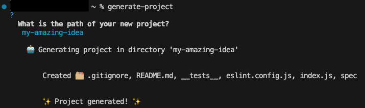

## Project generator

Based on this sprint:
https://l2c.northcoders.com/courses/fun/callback-heaven#sectionId=projectGenerator,step=intro

I wanted to practice all the different ways to do async code. I wrote the tests with async await, and I planned to write the solution with both callbacks and promises.

This tool requires _Node.js_, _npm_ and _git_

### How to run the project generator

1. Clone the repo

2. Install globally

```
npm i -g
```

3. Run the project generator

```
generate-project
```
You should see the following output:



This will initialise a project in the specified directory with:
- An index.js
- A spec folder
- An index.test.js
- A package.json set up with the basic dependencies and scripts
- A README.md file
- An eslint config file
- A .gitignore file
- A git repository initialised

### How to run the tests
From the root directory of this repo, run:
```
npm test promises
```

_In future: npm test callbacks_
